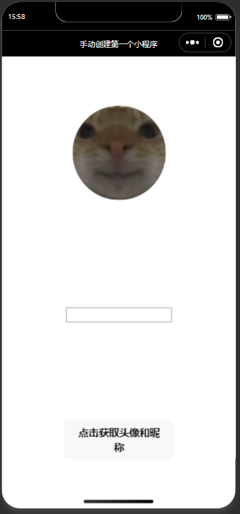
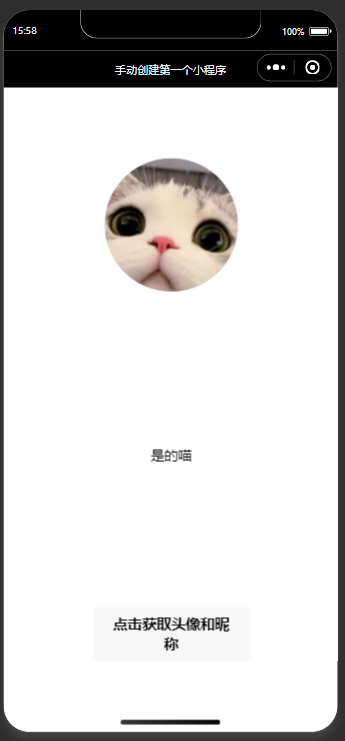

# 2025年夏季《移动软件开发》实验报告


## 一、实验目标

1、学习使用快速启动模板创建小程序的方法；2、学习不使用模板手动创建小程序的方法。


## 二、实验步骤

## 1.创建项目
先创建一个模板项目，再将该项目删除文件，使其变为无模板项目。

## 2.视图设计
通过设计导航栏和页面，实现获取用户头像和昵称并且显示的功能。

app.json:
```
{
  "pages": [
    "pages/index/index"
  ],
  "window": {
    "navigationBarTextStyle": "white",
    "navigationBarTitleText": "手动创建第一个小程序",
    "navigationBarBackgroundColor": "#000000"
  },
  "style": "v2",
  "componentFramework": "glass-easel",
  "lazyCodeLoading": "requiredComponents"
}
```


index.wxml:
```
<view class = 'container'>
    <image src='{{src}}' mode = 'widthFix'></image>
    <view class='getName'>
        <view wx:if="{{name}}">{{name}}</view>
        <input wx:else type="nickname" bindinput="getName" style="border:1px solid grey;" />
    </view>
    <button open-type="chooseAvatar"bind:chooseavatar="onChooseAvatar">点击获取头像和昵称</button>
</view>
```

index.wxss:
```
.container{
    height: 100vh;                 /*高100视窗*/
    display: flex;                 /*flex布局模式*/
    flex-direction: column;        /*垂直布局*/
    align-items: center;           /*水平方向居中*/
    justify-content: space-around; /*垂直方向分散布局*/
}
image{
    width:300rpx;
    border-radius: 50%;   /*4个角变为圆角形状*/
}
.getName{
    margin-top: 30rpx;
} 
```

## 3.逻辑实现
通过点击按钮调用函数，获取用户头像和昵称，并显示在页面上。

index.ts:
```
Page({
  data: {
    src:'/images/logo.png', //默认头像
    name:''                 //默认昵称
  },
  onChooseAvatar(e:any){
      //获取头像
      const { avatarUrl } = e.detail;
      this.setData({
          src:avatarUrl,
        })
    },
  getName(e:any) {
    //获取昵称
    const {value} = e.detail;
    this.setData({
      name: value
    })
  },
})
```

## 4.运行程序


## 三、程序运行结果
获取信息前界面:



获取信息后界面:




## 四、问题总结与体会

问题：由于微信平台改版，无法直接获取用户头像和昵称，导致无法正确显示用户信息。

解决方法：通过分步获取用户的头像和昵称，并在获取成功后再进行显示。

参考连接：https://blog.csdn.net/cau_eric/article/details/148693912


收获与体会：初步实现了一个基本的小程序应用，了解了小程序的基本结构和开发流程。

课程建议：建议介绍一些关于小程序最新的，基本的开发知识。
