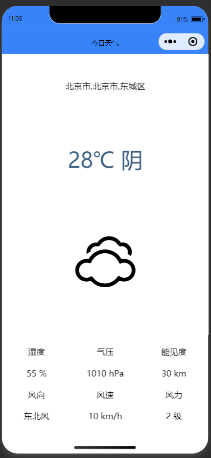
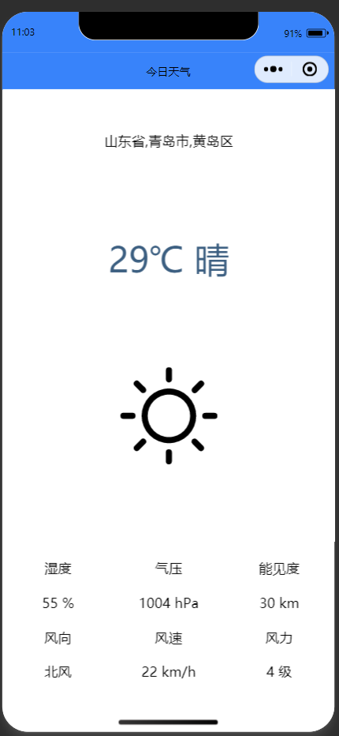

# 2025年夏季《移动软件开发》实验报告


## 一、实验目标

1、学习使用快速启动模板创建小程序的方法；2、学习不使用模板手动创建小程序的方法。


## 二、实验步骤

## 1.准备api
进入和风天气官网，注册账号，进入控制台，创建项目并创建凭据，获得API HOST 和 API Key。

## 2.创建项目
先创建一个模板项目，再将该项目删除文件，使其变为无模板项目。

## 3.视图设计
通过设计导航栏和页面，实现获取实时天气并显示。

app.json:
```
{
  "pages": [
    "pages/index/index"
  ],
  "window": {
    "navigationBarTextStyle": "black",
    "navigationBarTitleText": "今日天气",
    "navigationBarBackgroundColor": "#3883FA"
  },
  "style": "v2",
  "componentFramework": "glass-easel",
  "sitemapLocation": "sitemap.json",
  "lazyCodeLoading": "requiredComponents"
}
```
app.wxss:
```
/*背景容器样式*/
.container{
    height: 100vh;
    display: flex;
    flex-direction: column;
    align-items: center;
    justify-content: space-around;
}
```

index.wxml:
```
<view class = 'container'>
    <!--区域1：地区选择器-->
    <picker mode = 'region' bindchange="regionChange">
        <view>{{region}}</view>
    </picker>
    <!--区域2：单行天气信息-->
    <text>{{now.temp}}℃ {{now.text}}</text>
    <!--区域3：天气图标-->
    <image src = '/images/icons/{{now.icon}}.svg' mode = 'widthFix'></image>
    <!--区域4：多行天气信息-->
    <view class = 'detail'>
        <view class = 'bar'>
            <view class = 'box'>湿度</view>
            <view class = 'box'>气压</view>
            <view class = 'box'>能见度</view>
        </view>
        <view class = 'bar'>
            <view class = 'box'>{{now.humidity}} %</view>
            <view class = 'box'>{{now.pressure}} hPa</view>
            <view class = 'box'>{{now.vis}} km</view>
        </view>
        <view class = 'bar'>
            <view class = 'box'>风向</view>
            <view class = 'box'>风速</view>
            <view class = 'box'>风力</view>
        </view>
        <view class = 'bar'>
            <view class = 'box'>{{now.windDir}} </view>
            <view class = 'box'>{{now.windSpeed}} km/h</view>
            <view class = 'box'>{{now.windScale}} 级</view>
        </view>
    </view>
</view>>
```

index.wxss:
```
/*文本样式*/
text{
    font-size: 80rpx;
    color: #3C5F81;
}
/*图标样式*/
image{
    width: 220rpx;
}
/*区域4整体样式*/
.detail{
    width: 100%;
    display: flex;
    flex-direction: column;
}
/*区域4单元行样式*/
.bar{
    display: flex;
    flex-direction: row;
    margin: 20rpx 0;
}
/*区域4单元格样式*/
.box{
    width: 33.3%;
    text-align: center;
}
```

## 4.逻辑实现
通过点击按钮调用函数，获取用户头像和昵称，并显示在页面上。

index.js:
```
Page({
  data: {
    region:['山东省','青岛市','崂山区'],
    locationID:101120201,
    now:{
        temp:0,
        text:'未知',
        icon:'999',
        humidity:0,
        pressure:0,
        vis:0,
        windDir:0,
        windSpeed:0,
        windScale:0
    }
  },
  //更新地区信息
  regionChange: function(e){
      //console.log(e.detail.value)
      this.setData({region: e.detail.value});
      this.getlocationID().then(result => {
          this.getWeather();
      })
  },

  /*获取天气*/
  getWeather: function(){
      var that = this;
      wx.request({
        url: 'https://p36heww3wj.re.qweatherapi.com/v7/weather/now',
        data:{
            location: that.data.locationID,
            key:'42af207bb15c4539969227a884bf8593'
        },
        success:function(res){
            console.log(res.data);
            that.setData({now: res.data.now})
        }
      })
  },

  /*获取locationID*/
  getlocationID: function(){
      var that = this;
      return new Promise(resolve => {
        wx.request({
          url: 'https://p36heww3wj.re.qweatherapi.com/geo/v2/city/lookup?',
          data:{
              location:that.data.region[1],
              adm:that.data.region[0],
              key:'42af207bb15c4539969227a884bf8593'
          },
          success: res => {
              console.log(res.data);
              that.setData({locationID:res.data.location[0].id})
              return resolve();
          },
        })
      });
  },

  onLoad: function (options) {
    this.getlocationID().then(result => {
        this.getWeather();
    })
  },

  onReady: function () {},
  onShow: function () {},
  onHide: function () {},
  onUnload: function () {},
  onPullDownRefresh: function () {},
  onReachBottom: function () {},
  onShareAppMessage: function () {}
})
```

## 5.运行程序


## 三、程序运行结果
获取信息前界面:



获取信息后界面:




## 四、问题总结与体会

问题：直接使用实时天气api:"https://p36heww3wj.re.qweatherapi.com/v7/weather/now" 无法获取到实时天气信息。

解决方法：先通过Geoapi:"https://p36heww3wj.re.qweatherapi.com/geo/v2/city/lookup?" 获取城市的locationID，然后再通过天气api获取实时天气。

参考连接：https://blog.csdn.net/qq_54484914/article/details/126409385


收获与体会：实现了一个可以根据地区获取实时天气的微信小程序，也了解到了如何使用Geoapi获取locationID，并使用天气api获取实时天气信息，加深了对微信小程序开发的理解和运用。

课程建议：建议发布较新的实验教程。
