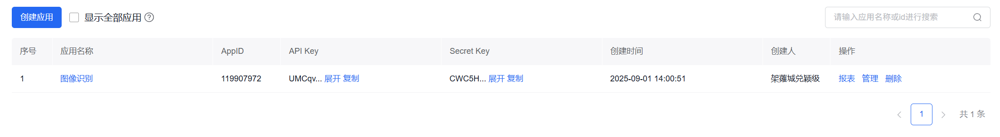
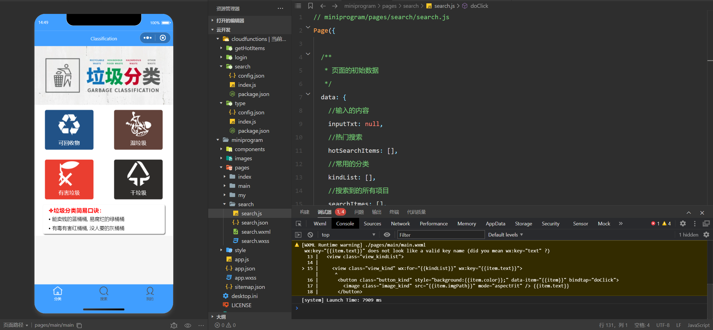
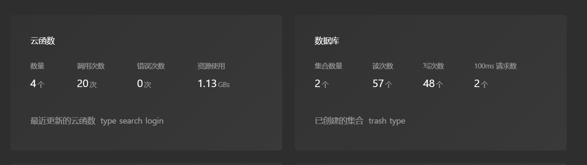
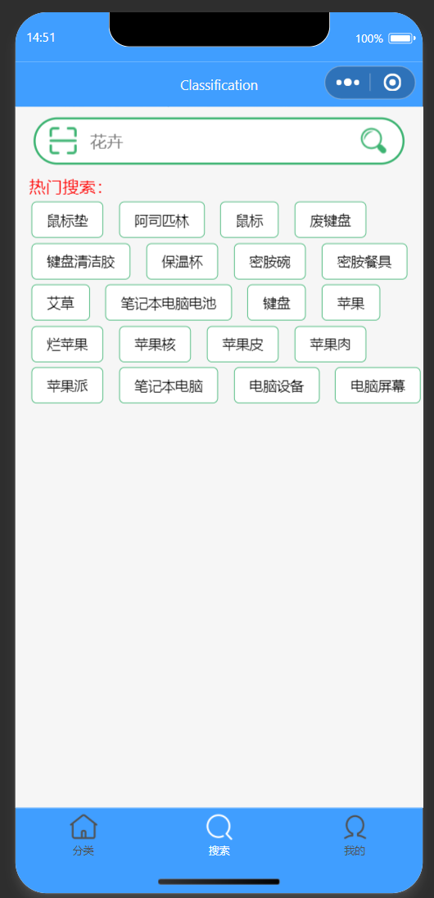
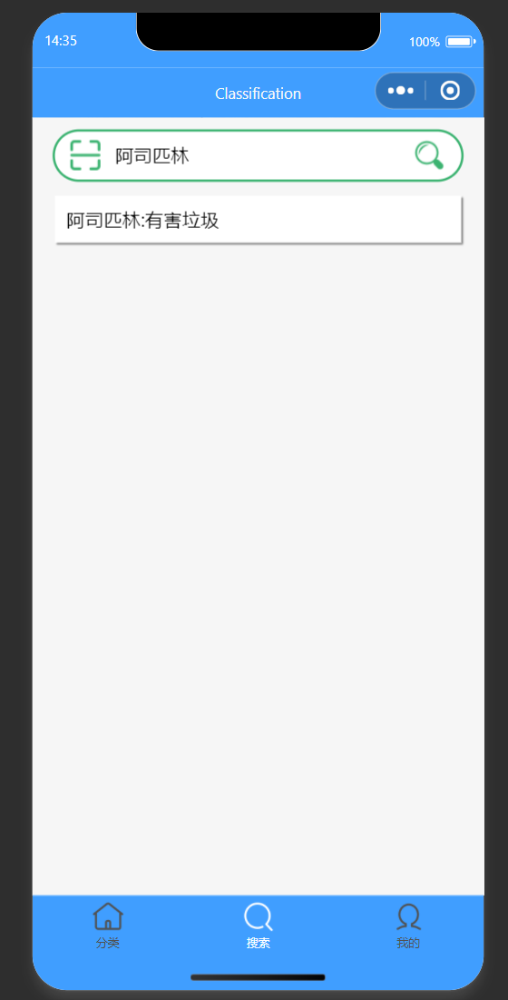
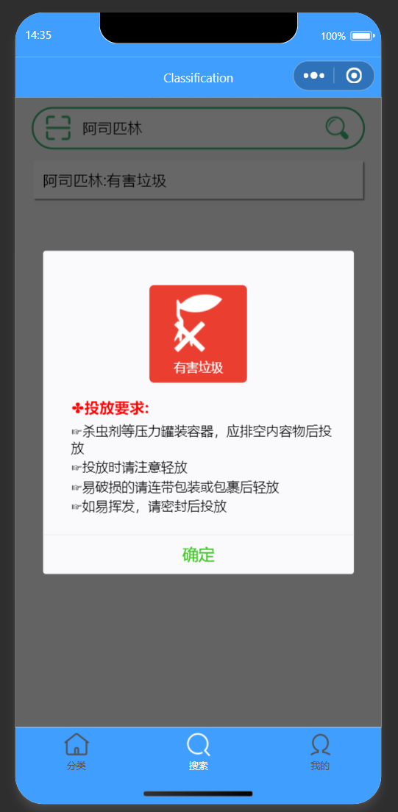

# 2025年夏季《移动软件开发》实验报告

## 一、实验目标

1、学习微信小程序云开发的基础知识。

## 二、实验步骤

## 1.准备api
注册百度智能云并实名认证, 创建一个图像识别应用, 记录应用API KEY 和 SECRET KEY。

## 2.创建项目
创建一个使用云开发的模板项目。

## 3.部署代码
下载提供的代码并进行部署。

## 4.部署云函数和云数据库

## 5.运行程序

## 三、程序运行结果
搜索页面：

搜索结果：

详细信息：

## 四、问题总结与体会

问题：无

解决方法：无

参考连接：https://gitee.com/xxwan/garbage-sorting-applet#%E5%9E%83%E5%9C%BE%E5%88%86%E7%B1%BB%E5%B0%8F%E7%A8%8B%E5%BA%8F%E9%83%A8%E7%BD%B2%E6%AD%A5%E9%AA%A4

收获与体会：体验了微信小程序的云开发。

课程建议：上课讲解助于理解。
