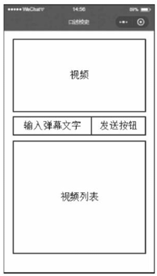
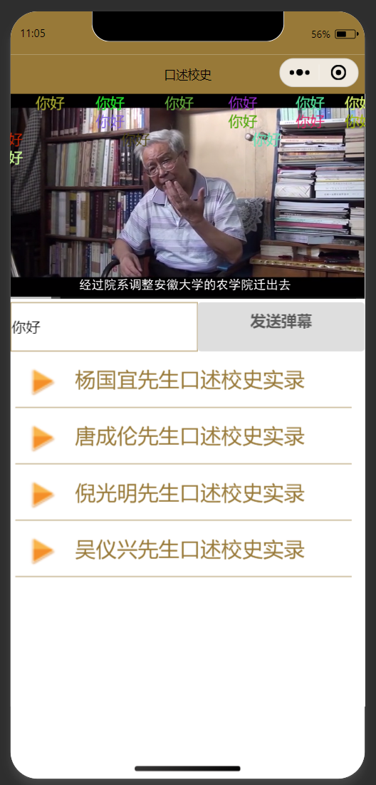

# 2025年夏季《移动软件开发》实验报告


## 一、实验目标

1、掌握视频API的操作方法；2、掌握如何发送随机颜色的弹幕。


## 二、实验步骤

## 1.创建项目
先创建一个模板项目，再将该项目删除文件，使其变为无模板项目。

## 2.视图设计
大致效果


app.json:
```
{
  "pages": [
    "pages/index/index"
  ],
  "window": {
    "navigationBarTextStyle": "black",
    "navigationBarTitleText": "口述校史",
    "navigationBarBackgroundColor": "#987938"
  },
  "style": "v2",
  "componentFramework": "glass-easel",
  "sitemapLocation": "sitemap.json",
  "lazyCodeLoading": "requiredComponents"
}
```

index.wxml:
```
<!--视频播放区域-->
<video id = "myVideo" controls src = "{{src}}" controls enable-danmu danmu-btn></video>

<!--弹幕控制-->
<view class = "danmuArea">
    <input type = "text" placeholder = "请输入弹幕" bindinput = "getDanmu"></input>
    <button bindtap = "sendDanmu">发送弹幕</button>
</view>

<!--视频列表-->
<view class = "VideoList">
    <view class = "VideoBar" wx:for="{{list}}" wx:key="video{{index}}" data-url = "{{item.videoUrl}}" bindtap = "playVideo">
        <image src = "/images/play.png"></image>
        <text>{{item.title}}</text>
    </view>
</view>
```

index.wxss:
```
/*播放视频*/
video{
    width:100%;
}

/*弹幕控制*/
.danmuArea{
    display: flex;
    flex-direction: row;
}
input{
    border: 1rpx solid #987938;
    flex-grow: 1;
    height: 100rpx;
}
button{
    color: white;
    background-color: #987938;
}

/*视频列表*/
.VideoList{
    width: 100%;
    min-height: 400rpx;
}
.VideoBar{
    width: 95%;
    display: flex;
    flex-direction: row;
    border-bottom: 1rpx solid #987938;
    margin: 10rpx;
}
image{
    width: 70rpx;
    height: 70rpx;
    margin: 20rpx;
}
text{
    font-size: 45rpx;
    color: #987938;
    margin: 20rpx;
    flex-grow: 1;
}
```

## 3.逻辑实现
通过点击视频列表替换视频播放器的视频地址，实现切换视频，然后使用微信自带功能实现弹幕功能。

index.js:
```
/*生成随机颜色*/
function getRandomColor() {
    let rgb = [];
    for (let i = 0; i<3; ++i){
        let color = Math.floor(Math.random() * 256).toString(16)
        color = color.length == 1 ? '0' + color: color
        rgb.push(color)
    }  
    return '#' + rgb.join('')
  }
Page({
  data: {
      danmuTxt: "",
    list: [
      { 
        id: '1001', 
        title: '杨国宜先生口述校史实录', 
        videoUrl: 'http://arch.ahnu.edu.cn/__local/6/CB/D1/C2DF3FC847F4CE2ABB67034C595_025F0082_ABD7AE2.mp4?e=.mp4'
      }, 
      { 
        id: '1002', 
        title: '唐成伦先生口述校史实录', 
        videoUrl: 'http://arch.ahnu.edu.cn/__local/E/31/EB/2F368A265E6C842BB6A63EE5F97_425ABEDD_7167F22.mp4?e=.mp4'
      }, 
      { 
        id: '1003', 
        title: '倪光明先生口述校史实录', 
        videoUrl: 'http://arch.ahnu.edu.cn/__local/9/DC/3B/35687573BA2145023FDAEBAFE67_AAD8D222_925F3FF.mp4?e=.mp4'
      }, 
      { 
        id: '1004', 
        title: '吴仪兴先生口述校史实录', 
        videoUrl: 'http://arch.ahnu.edu.cn/__local/5/DA/BD/7A27865731CF2B096E90B522005_A29CB142_6525BCF.mp4?e=.mp4'
      } 
    ]
  },
  playVideo:function(e){
      // 停止之前的视频
      this.videoCtx.stop()
      // 更新视频地址
      this.setData({
          src: e.currentTarget.dataset.url
      })
      // 播放现在的视频
      this.videoCtx.play()
  },

  /*更新弹幕 */
  getDanmu: function(e) {
    this.setData({
        danmuTxt: e.detail.value
    })
  },
  /*发送弹幕*/
  sendDanmu: function (e) {
    let text = this.data.danmuTxt;
    this.videoCtx.sendDanmu({
        text: text,
        color: getRandomColor()
    })  
  },
  onLoad: function (options) {
    this.videoCtx = wx.createVideoContext("myVideo")
  },
  onReady: function () {},
  onShow: function () {},
  onHide: function () {},
  onUnload: function () {},
  onPullDownRefresh: function () {},
  onReachBottom: function () {},
  onShareAppMessage: function () {}
})
```

## 4.运行程序


## 三、程序运行结果
最终效果界面:




## 四、问题总结与体会

问题：无

解决方法：无

收获与体会：本次实验让我掌握了视频API的操作方法，并学会了如何发送随机颜色的弹幕，加深了对微信小程序开发的理解与运用。

课程建议：上课讲解实验有助于理解。
